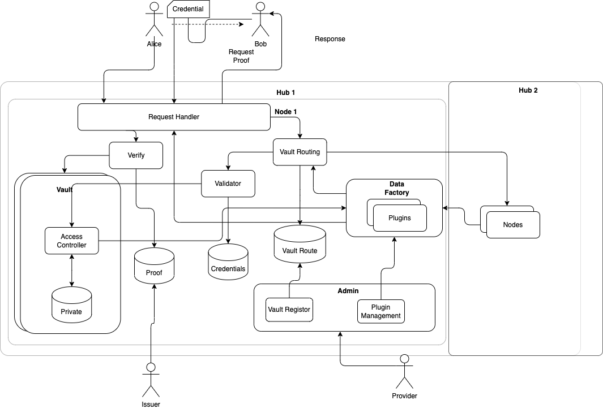
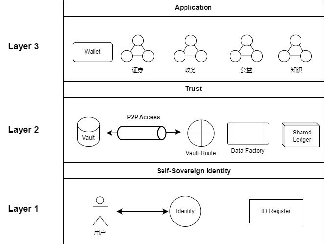

# 总体架构

## 什么是 Bytehub+

Bytehub+ 致力于创建去中心化可信基础设施！**Fusion** 是 Bytehub+ 是实现这一目标的核心开源项目。

## 图1：架构图

## Tech Stack

### 图2：分层架构

### Layer 1

第一层提供自治ID（Self-Sovereign Identity， SSI）以及ID注册服务。

#### SSI

SSI的基于非对称性加密算法和哈希函数，根据用户的公钥生成的唯一ID。用户的私钥是不可预测的随机数，可以用私钥对数据进行签名。要使用SSI的数据或者以 SSI 与其他 SSI 通信时，必须使用对应的私钥进行签名，由于私钥只有用户一个人保管，因此通过验证签名可以确定用户的身份。

### ID 注册

一个 SSI 要与网络上的其他 SSI 通信，必须在某个服务器节点上注册。服务器节点为用户提供网络通信、路由以及数据存储能力。一个轻量级的服务器节点可以由用户自己提供，也可以托管给其他机构提供。

### Layer 2

用户通过与可信的用户交互获得可信数据，进而形成自己的信用。

#### Vault

Vault 用来存储用户数据。每个 Vault 可以被若干个 Controller SSI 管理，Controller 负责进行数据访问控制。Vault 中的数据通常是加密的，只有 Controller 授权的用户才可以访问其中的数据。

### Access Control

用户可以授权其他用户访问自己的 Vault，获得授权的用户可以对 Vault 进行读、写操作。

### Vault Route

节点的路由功能可以将用户的访问请求转发给 Vault 所在的节点，对用户来说只需要关系他想要访问的 Vault，而不必关心它位于何处。

### Data Factory

用户访问数据时即可以访问原始数据，也经过一定的规则处理之后共享，处理该规则的组件称为 Data Factory。

### Shared Ledger

共享账本（Shared Ledger）为所有有权限访问的用户提供一致的数据，用权限访问共享账本的用户可以根据业务需要读写账本上的数据。

## Layer 3

该层为应用层。

### 钱包

钱包是用户管理用户数据以及与其他用户交互的终端。
