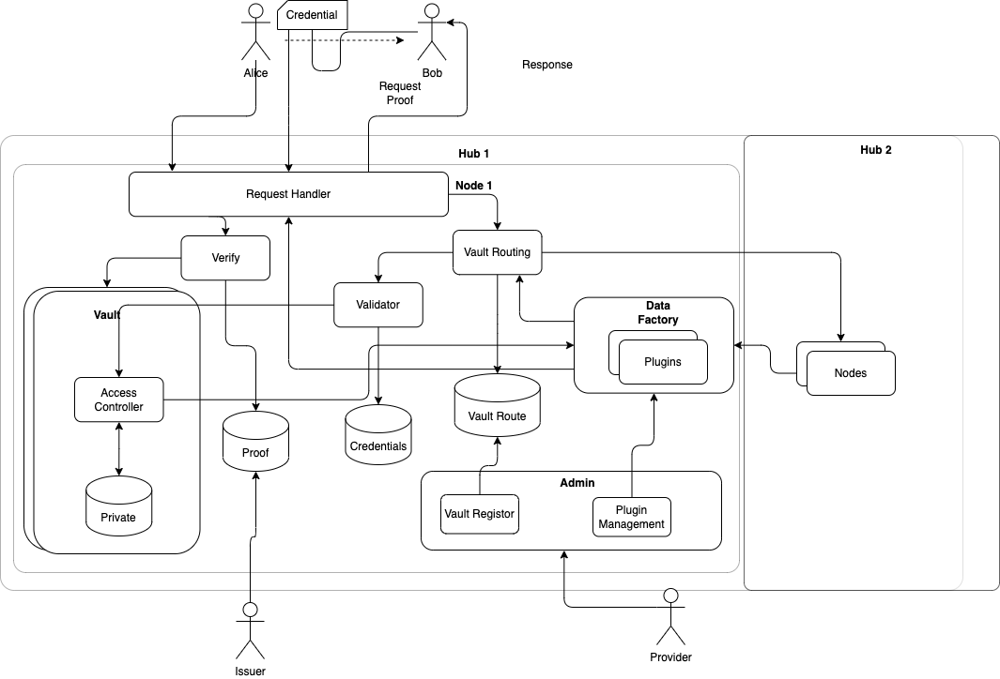

# Vault

# Identity

每个人均有唯一的Identity（ID），与此ID相关的数据存储在该ID的Vault中。

# Controller 

每个Vault 可以一个或者多个Controller，Controller对Vault有控制权限。

## Section

Vault按照Section（区）划分数据，默认数据存储在Primary区。与其他人协助的数据存储在其他区。

## Entry

一个 Vault 中可以存储多个数据项，每个数据项称为一个 Entry。Entry 以 Key-Value 对的形式保存，其 Key 是根据 Value 和一个随机数生成的哈希值，它具有唯一性、切不可预测，其 Valut 可以为任何形式的数据，其内容通常是加密的，对于不敏感的数据也可以以明文保存。

## Vault access

要访问一个 Vault 内的数据，必须通过 Vault 的访问控制逻辑。

### 写与删除数据

仅有 Vault 的 Controller 才有向 Vault 中写入或者删除数据的权限。

### 读数据

Vault 的 Controller 可以向其他用户共享数据，共享时 Vault 的 Controller 须向被共享的人提供 Entry ID 以及访问证明。

### 协助区

每个Vault可以有若干个协作区，其他用户可以向协作区进行读写数据，以实现用户之间的协助。协作区拥有唯一的区号，区号默认为对方的Vault ID或者是Data Factory的ID。

权限控制通过Sec+Operation=True/False控制。例如允许0XABCD读数据，则记为0XABCDREAD=True。

