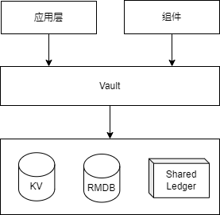

# Vault

Vault 是核心组件，负责处理用户数据的存储逻辑。向上对其他组件、应用提供访问接口，向下支持不同的持久化存储，例如键值数据库、关系数据库、区块链等。



## 数据区

Vault 按照 Section（区）划分数据，默认数据存储在 Primary 区。与其他人协助的数据存储在其他区。

## 协助区

每个 Vault 可以有若干个协作区，其他用户可以向协作区进行读写数据，以实现用户之间的协助。协作区拥有唯一的区号，区号默认为对方的 Vault ID 或者是 Byte Factory 的 ID。

协作区仍然使用 DID Document 描述，通过`authentication`验证则能访问其中的数据。

## 数据项

一个 Vault 中可以存储多个数据项，每个数据项称为一个 Entry。Entry 以 Key-Value 对的形式保存，其 Key 是根据 Value 和一个随机数生成的哈希值，它具有唯一性、切不可预测，其 Valut 可以为任何形式的数据，其内容通常是加密的，对于不敏感的数据也可以以明文保存。

## Vault 管理

### 注册

用户注册过程是用户进入 bytehubplus 生态的过程。在此过程中，用户和 Identity Provider 分别扮演了[W3 Verifiable Credential](https://www.w3.org/TR/vc-data-model/)的`Holder`和`Issuer`的角色。注册成功，用户获得 Identity Provider 的 VC。该 VC 可用于证明自己的身份。同时，Identity Provider 担任了 KYC 的角色。


用户注册前需要生成一对公私钥，并将自己的身份信息和公钥安全地发送给托管 Vault 的 Identity Provider。Identity Provider 为用户生成 DID 和 DID Document。Document 的`authentication`为该用户的公钥，用于授权签名验证。

Identity Provider 将托管地址写入 Document 的`ServiceEndpoint`，并对进行签名，然后返回给用户。

用户注册需要提交满足注册要求的信息。该要求应该是公开的，以便所有人都了解。用户提交的 Request 的`@context`字段表明需要满足的要求。

```json
{
  "@context": ["example.com/credential/v1.json"],
  "name": "Alice",
  "email": "alice@example.com",
  "phone": "+86 138 1234 5678",
  "authentication": [
    {
      "id": "did:example:123#key-1",
      "type": "Ed25519VerificationKey2020", // external (property value)
      "controller": "did:example:123", //to be filled or replaced by service provider with DID ID
      "publicKeyMultibase": "zAKJP3f7BD6W4iWEQ9jwndVTCBq8ua2Utt8EEjJ6Vxsf"
    }
  ]
}
```

Public Key in JWK format。

完成注册的 Response 是一个 VC，Identity Provider 将其保存在 Vault `Index`数据库，用户也可以保存在用户的 Vault 中，用户可以用于生成`Verifiable Presentation`(VP)证明自己的身份。

VC 示例：

```json
{

  "@context": [
    "https://www.w3.org/2018/credentials/v1",
    "https://www.w3.org/2018/credentials/examples/v1"
  ],

  "id": "http://example.edu/credentials/1872",

  "type": ["VerifiableCredential", "AlumniCredential"],

  "issuer": "https://example.edu/issuers/565049",

  "issuanceDate": "2010-01-01T19:23:24Z",

  "credentialSubject": {

    "id": "did:example:ebfeb1f712ebc6f1c276e12ec21",

    "alumniOf": {
      "id": "did:example:c276e12ec21ebfeb1f712ebc6f1",
      "name": [{
        "value": "Example University",
        "lang": "en"
      }, {
        "value": "Exemple d'Université",
        "lang": "fr"
      }]
    }
  },

  "proof": {

    "type": "RsaSignature2018",

    "created": "2017-06-18T21:19:10Z",

    "proofPurpose": "assertionMethod",

    "verificationMethod": "https://example.edu/issuers/565049#key-1",

    "jws": "eyJhbGciOiJSUzI1NiIsImI2NCI6ZmFsc2UsImNyaXQiOlsiYjY0Il19..TCYt5X
      sITJX1CxPCT8yAV-TVkIEq_PbChOMqsLfRoPsnsgw5WEuts01mq-pQy7UJiN5mgRxD-WUc
      X16dUEMGlv50aqzpqh4Qktb3rk-BuQy72IFLOqV0G_zS245-kronKb78cPN25DGlcTwLtj
      PAYuNzVBAh4vGHSrQyHUdBBPM"
  }
}
```
