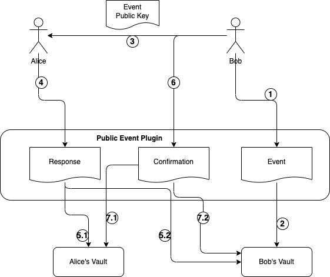

# Public Event

本RFC描述公共活动交互过程。所谓公共活动是指任何人都可以报名参与的活动，因此报名过程只需要参与者自己确认参与，而不需要组织者确认。

## 角色

Bob：活动组织者

Alice：活动参与者

## 过程说明

Bob和Alice均已完成Vault的注册。

1. Bob 发起一个公共活动
2. 公共活动处理模块，将信息写入Bob的Vault。
3. Bob 将次活动的报名地址与自己的公钥，公布给Alice。
4. Alice 确认报名，将报名信息发送给公共活动处理模块。
5. 公共处理模块将报名确认回执分别写入Bob和Alice的Vault。
6. 活动结束，Bob根据Alice在活动中的表现，确认Alice参与活动，并记录必要信息，例如打分。
7. 公共活动处理模块，将确认信息写入Bob和Alice的Vault中。

## 建议

1. Bob应该为每个活动使用专门的公私钥对。Bob 保管私钥，并使用该私钥进行交互。
2. Alice 接收Bob的公钥，说明Alice同意接收Bob对应私钥的签名数据。
3. Alice报名与确认参与的信息，需要在Bob与Alice之间共享、同步记录。
