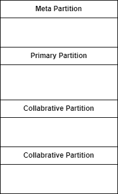

# Vault

Vault 是核心组件，负责处理用户数据的存储逻辑和访问控制逻辑。向上对其他组件、应用提供访问接口，向下支持不同的持久化存储，例如键值数据库、关系数据库、区块链等。

## 数据区

Vault 按照 Partition（区）划分数据，默认数据存储在 Primary 区。与其他人协助的数据存储在其他区。

## Meta Partition

__Meta Partition__ 存储 Vault 相关的元数据、访问控制数据等，该区数据不允许共享。

## Primary Partition

__Primary Partition__ 存储用户自己的数据。

## Collabrative Partition

每个 Vault 可以有若干个协作区，其他用户可以向协作区进行读写数据，以实现用户之间的协助。协作区拥有唯一的区号，区号默认为对方的 Vault ID 或者是 Byte Factory 的 ID。

协作区仍然使用 DID Document 描述，通过`authentication`验证则能访问其中的数据。

## 数据项

一个 Vault 中可以存储多个数据项，每个数据项称为一个 Entry。Entry 以 Key-Value 对的形式保存，其 Key 是根据 Value 和一个随机数生成的哈希值，它具有唯一性、切不可预测，其 Valut 可以为任何形式的数据，其内容通常是加密的，对于不敏感的数据也可以以明文保存。

__Vault 不感知数据__，数据的加解密、解析等由调用 Vault 的用户或者其他组件负责。
