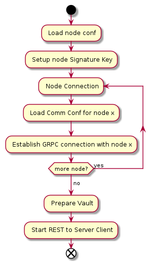

# Node Start Procedure
Rich Zhao
Oct 20, 2022

## Config
节点运行的端口、签名、通信等使用的签名私钥，邻居节点通信信息，以及Vault的存储等都应该在启动前配置在配置文件中。
## 与邻居节点建立连接
Node之间通信使用GRPC。从配置文件中读取邻居节点的地址、端口，签名、通信等证书，与邻居节点建立通信连接。
## Vault存储
节点托管的Vault的存储位置，Vault Index等从配置文件中读取。
